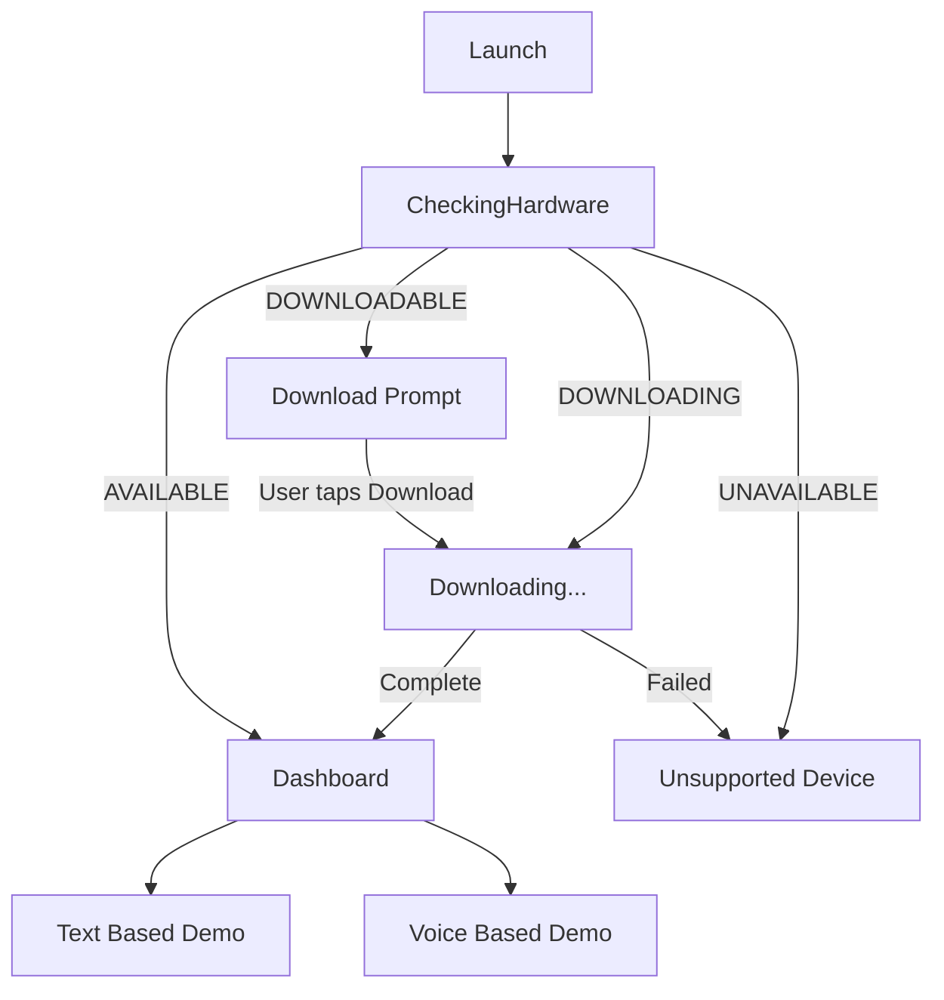

# AICoreBase

AICoreBase is an Android sample app that demonstrates **on-device AI** using Google's ML Kit GenAI APIs and **Gemini Nano** (delivered through Android AICore). It detects whether the device supports the local model, guides the user through downloading it when needed, and exposes two interactive demos: **text generation** and **voice-to-text**—all running offline on supported hardware.

## Features

- **Hardware-aware routing** — On launch, checks Gemini Nano availability via `Generation.checkStatus()` and routes the UI accordingly.
- **Model download flow** — Prompts the user to download the on-device engine when supported but not yet installed, with live progress updates.
- **Text generation** — Send prompts to Gemini Nano locally using the ML Kit Prompt API (`com.google.mlkit:genai-prompt`).
- **Voice recognition** — Capture microphone audio and transcribe it on-device using the ML Kit Speech Recognition API with Gemini Nano in advanced mode.
- **Jetpack Compose UI** — Material 3 screens built with Compose, ViewModels, and `StateFlow`.

## Requirements

| Requirement | Value |
|-------------|-------|
| Minimum SDK | 35 (Android 15) |
| Target SDK | 36 |
| Compile SDK | 37 |
| JDK | 11+ |
| Device | Android device with **AICore / Gemini Nano** support (e.g. Pixel 8 series or other AICore-enabled devices) |

Additional notes:

- **Microphone permission** (`RECORD_AUDIO`) is required for the voice demo.
- Model download typically requires **Wi-Fi**; failed downloads fall back to an unsupported-device state.
- Devices without Gemini Nano support show an "Unsupported Device" screen (LiteRT fallback is planned but not yet implemented).

## Tech Stack

- **Language:** Kotlin
- **UI:** Jetpack Compose, Material 3
- **Architecture:** ViewModel + `StateFlow`, sealed class screen states
- **On-device AI:**
  - `com.google.mlkit:genai-prompt:1.0.0-beta2` — text generation
  - `com.google.mlkit:genai-speech-recognition:1.0.0-alpha01` — speech recognition
- **Build:** Gradle 9.x, AGP 9.2.1, Kotlin 2.2.10

## Project Structure

```
app/src/main/java/com/thiyagaraaj/aicorebase/
├── MainActivity.kt              # Entry point; hosts BaseView in Compose
├── data/
│   └── AppScreenState.kt        # Sealed class for routing states
├── model/
│   ├── AiRouterViewModel.kt     # Hardware check + model download
│   ├── GeminiNanoViewModel.kt   # Text generation logic
│   └── VoiceAiViewModel.kt      # Microphone capture + speech recognition
├── view/
│   ├── BaseView.kt              # State-based screen router
│   ├── DashboardScreen.kt     # Text / Voice demo hub
│   ├── DownloadPromptScreen.kt
│   └── LoadingView.kt
├── screens/
│   └── MainScreen.kt            # Alternate scaffold wrapper (unused by MainActivity)
└── ui/theme/                    # Compose theme (Color, Type, Theme)
```

## App Flow



### Screen states (`AppScreenState`)

| State | Behavior |
|-------|----------|
| `CheckingHardware` | Shows loading while querying AICore status |
| `NeedsNanoDownload` | Prompts user to download the on-device model |
| `DownloadingNano` | Displays download progress |
| `PremiumNanoReady` | Opens the dashboard with Text and Voice demos |
| `FallbackToLiteRT` | Placeholder for unsupported devices / failed downloads |

## Getting Started

### 1. Clone the repository

```bash
git clone <repository-url>
cd AICoreBase
```

### 2. Open in Android Studio

Open the project root in **Android Studio** (Ladybug or newer recommended). Let Gradle sync complete.

### 3. Run on a physical device

Use a **physical AICore-enabled device**—the emulator generally does not support Gemini Nano.

```bash
# Windows
gradlew.bat installDebug

# macOS / Linux
./gradlew installDebug
```

Or run the **app** configuration from Android Studio.

### 4. Grant permissions

When using the voice demo, allow **microphone access** when prompted.

## Usage

1. **Launch the app** — It checks whether Gemini Nano is available on your device.
2. **Download (if prompted)** — Tap **Download** to fetch the on-device model over Wi-Fi.
3. **Choose a demo** from the dashboard:
   - **Text Based** — Enter a prompt and tap **Run On-Device** to get a local Gemini Nano response.
   - **Voice Based** — Tap **Start Listening**, speak, then **Stop Listening** to see live and final transcription.

## Key APIs

### Text generation

```kotlin
val generativeModel = Generation.getClient()
val response = generativeModel.generateContent(prompt)
val text = response.candidates?.firstOrNull()?.text
```

### Speech recognition

```kotlin
val options = speechRecognizerOptions {
    locale = Locale.US
    preferredMode = SpeechRecognizerOptions.Mode.MODE_ADVANCED
}
val speechRecognizer = SpeechRecognition.getClient(options)
speechRecognizer.startRecognition(request).collect { response -> /* ... */ }
```

## Development

### Run unit tests

```bash
gradlew.bat test          # Windows
./gradlew test            # macOS / Linux
```

### Run instrumented tests

Requires a connected device or emulator:

```bash
gradlew.bat connectedAndroidTest
```

## Known Limitations

- **LiteRT fallback** (`FallbackToLiteRT`) is a placeholder; custom `.gguf` model loading is not implemented.
- **Voice pipeline** records PCM audio via `AudioRecord` and also uses `AudioSource.fromMic()` in the speech request—these paths may need consolidation.
- **`MainScreen.kt`** defines an alternate top-bar layout but is not wired into `MainActivity`.
- APIs used (`genai-prompt`, `genai-speech-recognition`) are **beta/alpha** and may change.

## License

No license file is included in this repository. Add one if you plan to distribute or open-source the project.

## Author

**Thiyagaraaj** — `com.thiyagaraaj.aicorebase`
